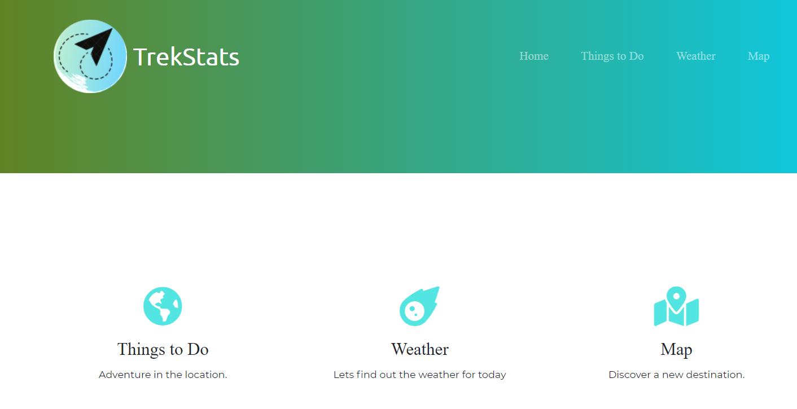

# TrekStats

## Table of contents

- [Task](#task)
- [User Story](#user-story)
- [Acceptance Criteria](#acceptance-criteria)
- [Deployment](#deployment)
- [Api's](#api's)
- [References](#references)

## Task

Create a travel application that allows a user to retrive information for travel, weather and restaurant based on city.


## User Story
- [Trello Tool](https://trello.com/b/4SR6qWK6/trekstats)

```md
Create a travel application that allows a user to retrive information for travel, weather and restaurant based on city name.

```


##  Acceptance Criteria: 


  * Application uses at least two [server-side APIs](https://coding-boot-camp.github.io/full-stack/apis/api-resources)

  * Application uses client-side storage to store persistent data.

  * Application is interactive (accepts and responds to user input)

 
## Tools Used
- [Trello](https://trello.com/b/4SR6qWK6/trekstats)
- [Presentation](https://docs.google.com/presentation/d/1iC_-F6MM6VzvH-WGRDveIY-pOAeZAb5NXOpQHV2z8hM/edit?usp=sharing)
- [Wireframe](https://lucid.app/lucidchart/3d5f8019-4d9a-474b-92d8-6d9f174a7078/edit?invitationId=inv_cd8f6b9c-6806-4e62-a50e-9530671377ac)


## Deployment
- [Github](https://github.com/dparmar32/TrekStats)
- [Deployed application](https://dparmar32.github.io/TrekStats/)

## Api's
- [Maps](https://developers.google.com/maps/documentation/)
- [Weather](https://www.visualcrossing.com/weather-api)
- [wiki](https://www.mediawiki.org/wiki/API:Main_page)
- [Restaurant](https://www.yelp.com/developers)

## TrekStats


## References
- [Bootstrap](https://getbootstrap.com/docs/4.6/getting-started/introduction/)
- [Font Awesome](https://fontawesome.com/v5.15/icons?d=gallery&p=2)
- [Design](https://www.canva.com/)
